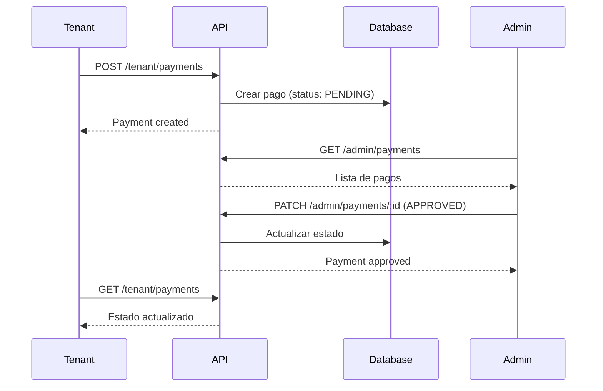
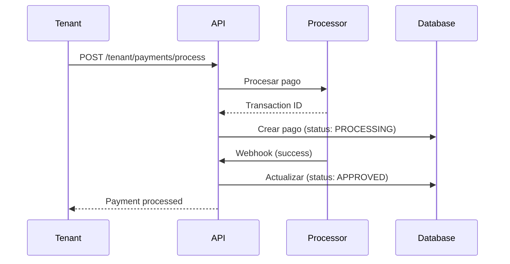
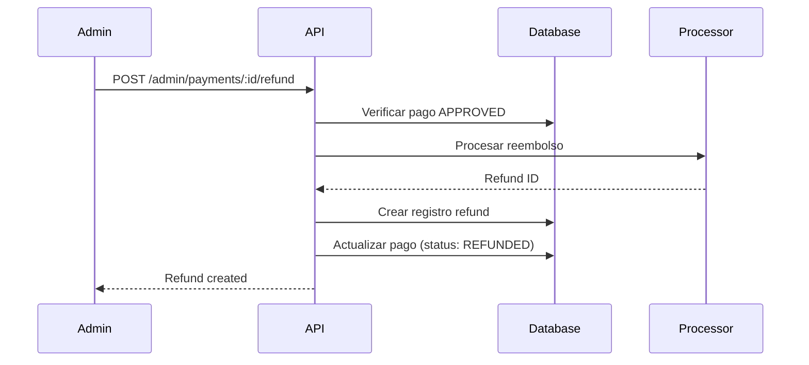

# Payment System Documentation

## 📋 Índice

1. [Descripción General](#descripción-general)
2. [Características](#características)
3. [Arquitectura](#arquitectura)
4. [Instalación](#instalación)
5. [API Endpoints](#api-endpoints)
6. [Modelos de Datos](#modelos-de-datos)
7. [Flujos de Trabajo](#flujos-de-trabajo)
8. [Integración con Procesadores](#integración-con-procesadores)
9. [Ejemplos de Uso](#ejemplos-de-uso)
10. [Consideraciones de Seguridad](#consideraciones-de-seguridad)

---

## 🎯 Descripción General

Sistema completo de gestión de pagos multi-moneda y multi-método inspirado en **Buildium**.
Diseñado para soportar pagos internacionales con múltiples procesadores y métodos de pago.

### Casos de Uso

- ✅ Gestión de pagos de renta
- ✅ Depósitos de seguridad
- ✅ Cargos por servicios y tarifas
- ✅ Pagos recurrentes/auto-pago
- ✅ Pagos parciales
- ✅ Reembolsos y reversiones
- ✅ Multi-moneda (USD, EUR, GBP, MXN, etc.)
- ✅ Múltiples procesadores (Stripe, PayPal, Square, etc.)

---

## ⚡ Características

### Métodos de Pago Soportados

**Estados Unidos:**
- ACH (Automated Clearing House)
- Credit/Debit Cards
- eCheck
- Zelle
- Venmo
- Money Orders
- Checks

**Europa:**
- SEPA (Single Euro Payments Area)
- Credit/Debit Cards
- Bank Transfers

**Latinoamérica:**
- Transferencias bancarias
- Efectivo
- Tarjetas de crédito/débito

**Procesadores Online:**
- Stripe
- PayPal
- Square
- Authorize.Net
- Plaid (ACH)
- Dwolla (ACH)
- Mercado Pago

### Tipos de Pagos

- `RENT` - Renta mensual
- `DEPOSIT` - Depósito de seguridad
- `LATE_FEE` - Cargo por retraso
- `UTILITY` - Servicios públicos
- `HOA_FEE` - Cuota HOA
- `PET_FEE` - Cargo por mascota
- `PARKING_FEE` - Estacionamiento
- `APPLICATION_FEE` - Tarifa de solicitud
- `MAINTENANCE_FEE` - Mantenimiento
- `OTHER` - Otros cargos

### Estados del Pago

1. `PENDING` - Pendiente de aprobación
2. `PROCESSING` - Siendo procesado
3. `APPROVED` - Aprobado y completado
4. `REJECTED` - Rechazado
5. `FAILED` - Falló el procesamiento
6. `REFUNDED` - Reembolsado
7. `REVERSED` - Revertido
8. `DISPUTED` - En disputa

### Monedas Soportadas

- USD 🇺🇸 - Dólar estadounidense
- EUR 🇪🇺 - Euro
- GBP 🇬🇧 - Libra esterlina
- CAD 🇨🇦 - Dólar canadiense
- MXN 🇲🇽 - Peso mexicano
- BRL 🇧🇷 - Real brasileño
- COP 🇨🇴 - Peso colombiano
- CLP 🇨🇱 - Peso chileno
- PEN 🇵🇪 - Sol peruano
- ARS 🇦🇷 - Peso argentino
- BOB 🇧🇴 - Boliviano
- AUD 🇦🇺 - Dólar australiano

---

## 🏗️ Arquitectura

```
src/payments/
├── dto/                        # Data Transfer Objects
│   ├── create-payment.dto.ts
│   ├── update-payment-status.dto.ts
│   ├── payment-filters.dto.ts
│   ├── create-refund.dto.ts
│   └── index.ts
├── enums/                      # Enumeraciones
│   ├── payment-type.enum.ts
│   ├── payment-method.enum.ts
│   ├── payment-status.enum.ts
│   ├── currency.enum.ts
│   ├── payment-processor.enum.ts
│   └── index.ts
├── interfaces/                 # Interfaces TypeScript
│   └── payment.interface.ts
├── payments.controller.ts      # Controladores REST
├── payments.service.ts         # Lógica de negocio
├── payments.module.ts          # Módulo NestJS
└── README.md                   # Esta documentación

migrations/
└── create-payments-tables.sql  # Migración SQL
```

---

## 📦 Instalación

### 1. Ejecutar Migración SQL

```bash
cd ~/Proyectos/365soft/GestionAlquileres_365Soft-api
psql -U postgres -d gestion_alquileres -f migrations/create-payments-tables.sql
```

### 2. Verificar Instalación

El módulo ya está registrado en `app.module.ts`. Reinicia el servidor:

```bash
npm run start:dev
```

### 3. Verificar Endpoints

```bash
curl http://localhost:3000/jhammil123/admin/payments/stats
```

---

## 🔌 API Endpoints

### Admin Endpoints

| Método | Endpoint | Descripción |
|--------|----------|-------------|
| GET | `/:slug/admin/payments` | Listar todos los pagos con filtros |
| GET | `/:slug/admin/payments/stats` | Estadísticas generales |
| GET | `/:slug/admin/payments/:id` | Detalle de un pago |
| PATCH | `/:slug/admin/payments/:id` | Aprobar/Rechazar pago |
| DELETE | `/:slug/admin/payments/:id` | Eliminar pago |
| POST | `/:slug/admin/payments/:id/refund` | Crear reembolso |

### Tenant Endpoints

| Método | Endpoint | Descripción |
|--------|----------|-------------|
| POST | `/:slug/tenant/payments` | Registrar nuevo pago |
| GET | `/:slug/tenant/payments` | Mis pagos |
| GET | `/:slug/tenant/payments/stats` | Mis estadísticas |
| GET | `/:slug/tenant/payments/:id` | Detalle de mi pago |

---

## 📊 Modelos de Datos

### Payment (Pago)

```typescript
interface Payment {
  id: number;
  tenant_id: number;
  contract_id: number;
  property_id: number;

  amount: number;
  currency: Currency; // USD, EUR, GBP, etc.

  payment_type: PaymentType; // RENT, DEPOSIT, etc.
  payment_method: PaymentMethod; // ACH, CREDIT_CARD, etc.
  status: PaymentStatus; // PENDING, APPROVED, etc.

  payment_date: Date;
  due_date?: Date;
  processed_date?: Date;

  reference_number?: string;
  transaction_id?: string;
  check_number?: string;

  payment_processor: PaymentProcessor; // stripe, paypal, manual
  processor_fee?: number;

  proof_file?: string;
  receipt_file?: string;

  notes?: string;
  admin_notes?: string;
  rejection_reason?: string;

  is_partial_payment: boolean;
  parent_payment_id?: number;
  is_recurring: boolean;
  recurring_schedule_id?: number;
  is_autopay: boolean;

  created_by?: number;
  approved_by?: number;
  approved_at?: Date;

  metadata?: object;

  created_at: Date;
  updated_at: Date;
}
```

### PaymentStats (Estadísticas)

```typescript
interface PaymentStats {
  total_payments: number;
  total_pending: number;
  total_processing: number;
  total_approved: number;
  total_rejected: number;
  total_failed: number;
  total_amount_pending: number;
  total_amount_approved: number;
  total_amount_failed: number;
}
```

---

## 🔄 Flujos de Trabajo

### Flujo 1: Pago Manual (Sin Procesador)



### Flujo 2: Pago con Procesador (Stripe/PayPal)



### Flujo 3: Reembolso



---

## 💳 Integración con Procesadores

### Stripe

```typescript
// TODO: Implementar integración con Stripe SDK
// npm install stripe
import Stripe from 'stripe';

const stripe = new Stripe(process.env.STRIPE_SECRET_KEY);

async function processStripePayment(amount: number, currency: string) {
  const paymentIntent = await stripe.paymentIntents.create({
    amount: amount * 100, // Stripe usa centavos
    currency: currency.toLowerCase(),
    payment_method_types: ['card'],
  });

  return paymentIntent.id;
}
```

### PayPal

```typescript
// TODO: Implementar integración con PayPal SDK
// npm install @paypal/checkout-server-sdk
```

### Plaid (ACH - USA)

```typescript
// TODO: Implementar integración con Plaid
// npm install plaid
```

---

## 📝 Ejemplos de Uso

### Ejemplo 1: Registrar Pago (Tenant)

**Request:**
```bash
POST http://localhost:3000/jhammil123/tenant/payments
Authorization: Bearer {tenant_token}
Content-Type: application/json

{
  "amount": 1500.00,
  "currency": "USD",
  "payment_type": "RENT",
  "payment_method": "ACH",
  "payment_date": "2026-02-13",
  "reference_number": "ACH-123456789",
  "notes": "Pago de renta de febrero 2026"
}
```

**Response:**
```json
{
  "id": 42,
  "tenant_id": 5,
  "contract_id": 12,
  "property_id": 8,
  "amount": 1500.00,
  "currency": "USD",
  "payment_type": "RENT",
  "payment_method": "ACH",
  "status": "PENDING",
  "payment_date": "2026-02-13",
  "reference_number": "ACH-123456789",
  "notes": "Pago de renta de febrero 2026",
  "payment_processor": "manual",
  "created_at": "2026-02-13T12:00:00Z"
}
```

### Ejemplo 2: Aprobar Pago (Admin)

**Request:**
```bash
PATCH http://localhost:3000/jhammil123/admin/payments/42
Authorization: Bearer {admin_token}
Content-Type: application/json

{
  "status": "APPROVED",
  "admin_notes": "Verificado en cuenta bancaria. Pago aprobado."
}
```

**Response:**
```json
{
  "id": 42,
  "status": "APPROVED",
  "admin_notes": "Verificado en cuenta bancaria. Pago aprobado.",
  "approved_by": 1,
  "approved_at": "2026-02-13T12:30:00Z",
  "updated_at": "2026-02-13T12:30:00Z"
}
```

### Ejemplo 3: Listar con Filtros (Admin)

**Request:**
```bash
GET http://localhost:3000/jhammil123/admin/payments?status=PENDING&type=RENT&date_from=2026-02-01&date_to=2026-02-28&page=1&limit=20
Authorization: Bearer {admin_token}
```

**Response:**
```json
{
  "payments": [...],
  "total": 15,
  "page": 1,
  "limit": 20
}
```

### Ejemplo 4: Estadísticas (Admin)

**Request:**
```bash
GET http://localhost:3000/jhammil123/admin/payments/stats
Authorization: Bearer {admin_token}
```

**Response:**
```json
{
  "total_payments": 156,
  "total_pending": 23,
  "total_processing": 5,
  "total_approved": 118,
  "total_rejected": 8,
  "total_failed": 2,
  "total_amount_pending": 34500.00,
  "total_amount_approved": 177000.00,
  "total_amount_failed": 3000.00
}
```

---

## 🔒 Consideraciones de Seguridad

### 1. Autenticación y Autorización

- ✅ Todos los endpoints requieren autenticación JWT
- ✅ Tenants solo pueden ver/crear sus propios pagos
- ✅ Admins pueden ver/modificar todos los pagos

### 2. Validación de Datos

- ✅ Validación con class-validator en DTOs
- ✅ Montos mínimos y máximos
- ✅ Formatos de fecha estrictos
- ✅ Enums validados

### 3. Protección contra Fraude

- ✅ Verificar propiedad del pago (tenant)
- ✅ No permitir modificar pagos aprobados
- ✅ Límites de reembolso (no exceder monto original)
- ✅ Logging de todas las acciones

### 4. PCI Compliance (Datos de Tarjetas)

⚠️ **IMPORTANTE:**
- **NUNCA** guardar números de tarjetas completos
- **NUNCA** guardar CVV
- Usar tokens de procesadores (Stripe, PayPal)
- Cumplir con PCI DSS si procesas tarjetas directamente

### 5. GDPR y Privacidad

- ✅ Encriptar datos sensibles
- ✅ Permitir eliminación de datos (derecho al olvido)
- ✅ Audit logs de accesos a pagos

---

## 🧪 Testing

### Unit Tests (Pendiente)

```typescript
// payments.service.spec.ts
describe('PaymentsService', () => {
  it('should create a payment', async () => {
    // TODO: Implementar tests
  });

  it('should approve payment', async () => {
    // TODO: Implementar tests
  });
});
```

### Integration Tests (Pendiente)

```bash
# TODO: Implementar tests E2E
npm run test:e2e
```

---

## 📈 Roadmap / TODOs

- [ ] Implementar integración con Stripe
- [ ] Implementar integración con PayPal
- [ ] Implementar pagos recurrentes automáticos
- [ ] Generación de recibos PDF
- [ ] Exportación a CSV/Excel
- [ ] Webhooks para procesadores
- [ ] Notificaciones por email
- [ ] Panel de reportes avanzados
- [ ] Soporte para splits de pago
- [ ] Calculadora de impuestos

---

## 📞 Soporte

Para preguntas o problemas, contactar al equipo de desarrollo.

**Última actualización:** 2026-02-13
**Versión:** 1.0.0
